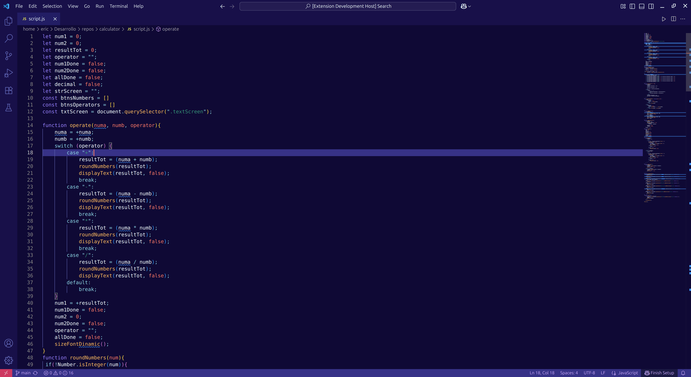
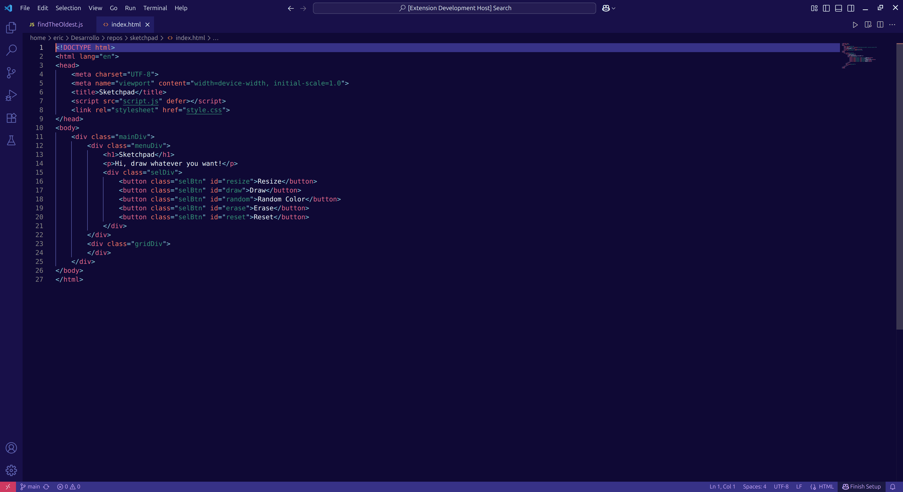

# Purple Space Dreams 🚀

A vibrant theme for Visual Studio Code inspired by Y2K aesthetics and space. Perfect if you enjoy coding with a touch of purple nostalgia.

---

## Screenshots

Here's how **Purple Space Dreams** looks in action.

**JavaScript / TypeScript**

**HTML & CSS**

*(Note: You will need to create a `screenshots` folder in your project and add your own screenshots with these filenames for them to appear here.)*

---

## Installation

1.  Open the **Extensions** sidebar in VS Code (`Ctrl+Shift+X`).
2.  Search for `Purple Space Dreams`.
3.  Click **Install**.
4.  Open the **Command Palette** (`Ctrl+Shift+P`), type `Color Theme` and select **Purple Space Dreams** from the list.

---

## Color Palette 🎨

The theme is built around this color palette:

| Color             | Hex       | Primary Use                |
| ----------------- | --------- | -------------------------- |
| Violet            | `#1b0b4c` | Editor Background          |
| Minsk             | `#3c2c8c` | UI Backgrounds (sidebar)   |
| Blue Violet       | `#5f5fb4` | Selections & Highlights    |
| Heliotrope        | `#9e7aff` | Keywords                   |
| Mauve             | `#d2a8ff` | Variables                  |
| Aquamarine Blue   | `#7fd4e1` | Punctuation & Operators    |
| Froly Pink        | `#f06090` | Classes & HTML Tags        |
| Observatory Green | `#009474` | Strings                    |
| Texas Yellow      | `#ffb84d` | Functions & Methods        |

---

## License

Distributed under the [MIT License](LICENSE).

---

**Enjoy the theme and happy coding!**